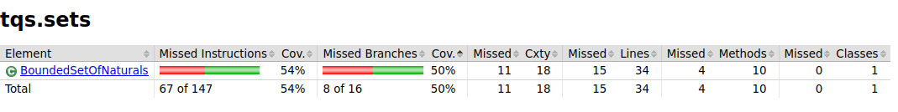

Comparando os resultados da cobertura para o caso da classe BoundedSetOfNaturals,
é de notar uma melhoria na cobertura, aumentando a percentagem de 54% para 78%.

## 1º resultados

    

## 2º resultados

    

