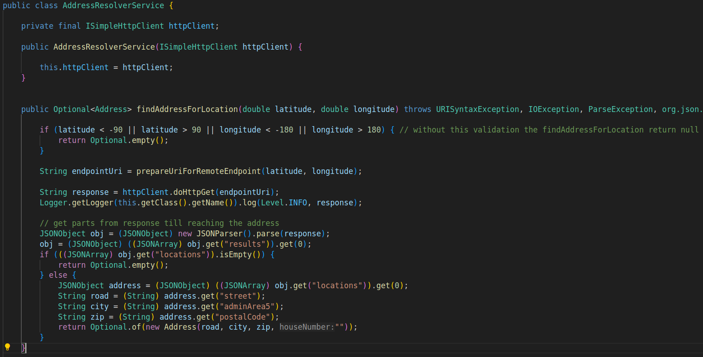
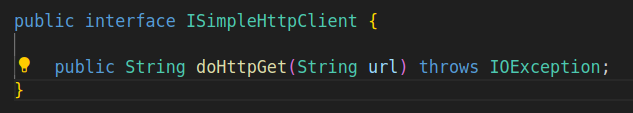
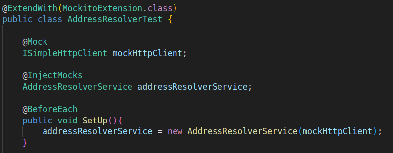

The SuT (subject under test) in this scenario is the AddressResolverService class, specifically the findAddressForLocation method. This method invokes a remote geocoding service to find the address for a given latitude and longitude.

    

The service to mock is the HTTP client used to make the actual HTTP request to the remote geocoding service. The ISimpleHttpClient interface represents this HTTP client, and it is passed to the AddressResolverService constructor.

    

By mocking this interface, we can control the behavior of the HTTP client in the tests without making real network requests.

