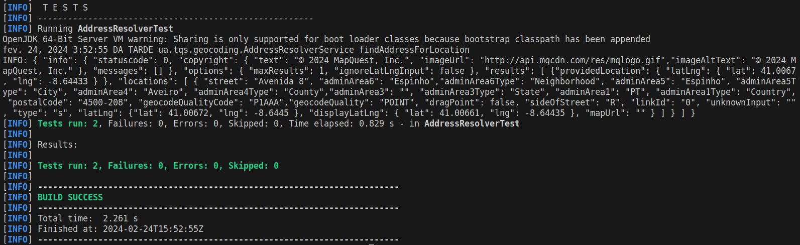
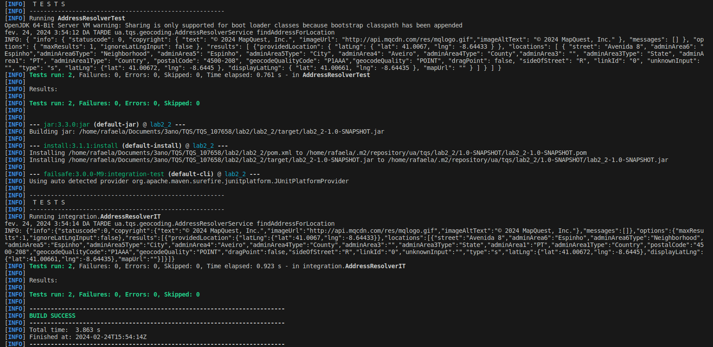

You should get different results with the following cases (try with and without internet connection):
$ mvn test
and
$ mvn install failsafe:integration-test

## *$ mvn test* results

    

## *$ mvn install failsafe:integration-test* results

    

**Note the number of tests and the time required to run the tests**