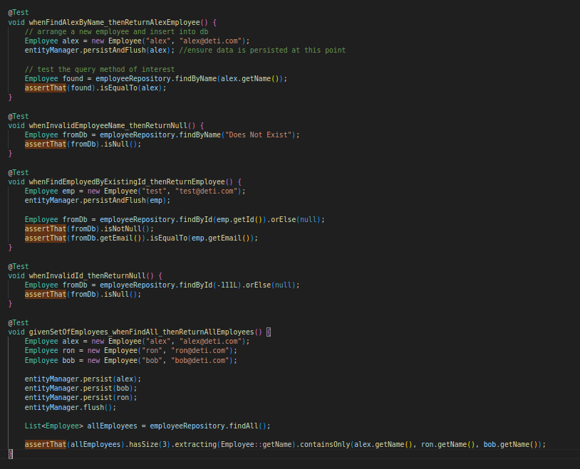
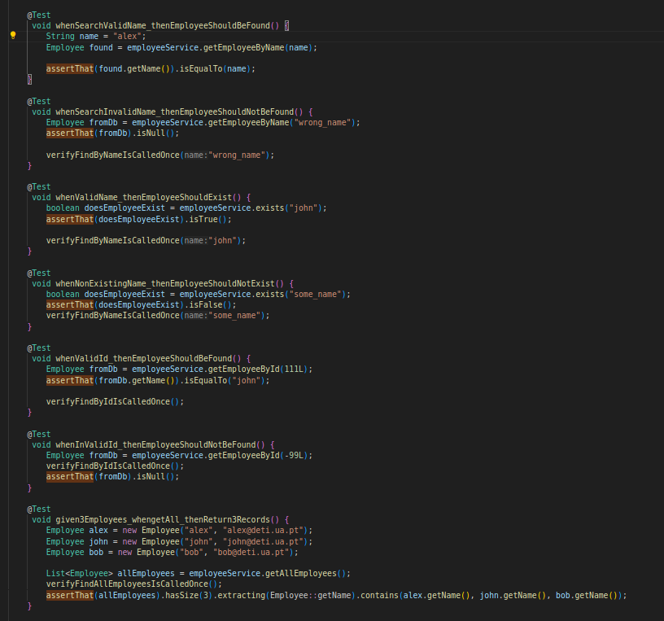
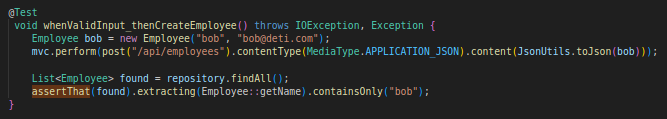
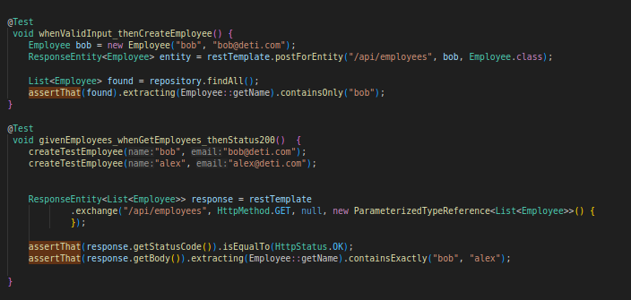
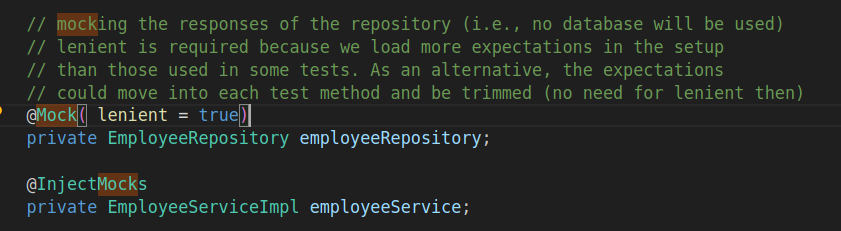

## Conclusões do exercício 1 do lab3

**a) Identify a couple of examples that use AssertJ expressive methods chaining.**
Tanto nos testes da classe A_EmployeeRepositoryTest.java como da class B_EmployeeService_UnitTest.java se usam métodos expressivos de AssertJ. Os testes da classe D_EmployeeRestControllerIT.java e da classe E_EmployeeRestControllerTemplateIT.java também usam assertions AssertJ.
Na classe A_EmployeeService_UnitTest.java todos os testes utilizam o método **assertThat()** e utilizam, posteriormente, **chaining string specific assertions**. O mesmo acontece com os testes da classe B_EmployeeService_UnitTest.java, sem serem os testes de verificação.

**Classe A_EmployeeRepositoryTest.java**


**Classe B_EmployeeService_UnitTest.java**


**Classe D_EmployeeRestControllerIT.java**


**Classe E_EmployeeRestControllerTemplateIT.java**


**b) Identify an example in which you mock the behavior of the repository (and avoid involving a database).**
Na classe B_EmployeeService_UnitTest.java o repositórios dos empregados é anotado com a notação @Mock.



**c) What is the difference between standard @Mock and @MockBean?**

A anotação @Mock é usada para fazer o _mocking_ dos objetos que não fazem parte do contexto Spring, é usada com Junit e Mockito e permite realizar testes sem a implementação final de uma dependência Para aleḿ disso, é mais fácil de encontrar o mock problema em caso de falha uma vez que o nome aparece nas mensagens de erro. No entanto, a anotação @MockBean é usada para fazer o _mocking_ de objetos que fazem parte do contexto Spring, o que permite fazer testes de integração.

**d) What is the role of the file “application-integrationtest.properties”? In which conditions will it be used?**

O ficheiro **application-integrationtest.properties** tem configurações utilizadas pelo SpringBoot. O ficheiro tem a porta de acesso e as credenciais para aceder à base de dados.

```
    // adapt AutoConfigureTestDatabase with TestPropertySource to use a real database
    // @TestPropertySource(locations = "application-integrationtest.properties")
```

**e) the sample project demonstrates three test strategies to assess an API (C, D and E) developed with SpringBoot. Which are the main/key differences?**

A estratégia C utiliza as classes EmployeeRestController e EmployeeService.
Tem como objetivo principal testar o comportamento dos controllers. Os testes são corridos num ambiente que simula o comportamento de um servidor de aplicação com a anotação @WebMvcTest.
Esta estratégia utiliza mocks, nas dependências do serviço.
Os pedidos são feitos através do **mvc**, uma instância da classe MockMVC que oferece um entry point de teste. O MockMVC oferece uma API expressiva onde é expectado que se utilizem métodos de chaining.

Tanto a estratégia D com a estratégia E é usada toda a aplicação, incluindo uma base de dados.

A estratégia D, tal como a C, também usa uma instância da classe MockMVC para simular os pedidos e respostas HTTP.

Na estratégia E, a REST API é testada com um cliente HTTP explícito. É usado um cliente REST para criar pedidos realistas através da classe TestRestTemplate.
Esta estratégia é semelhante à estratégia D, mas em vez de aceder a um servlet entry point para testes usa uma API client.