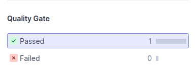

**Has your project passed the defined quality gate?**

O projeto passou o quality gate definido na sua primeira análise.

    

A nível de segurança e fiabilidade os resultados foram 0, na capacidade de manutenção os resultados foram 24.
A percentagem de hotspots reviewed foi de 0.0%, a mesma percentagem de duplicações.
Por fim, a cobertura geral foi de 75.0%.

    

**Explore the analysis results and complete with a few sample issues, as applicable.**

| Issue | Problem description | How to solve |
| ----- | ------------------- | ------------ |
| **Security Hotspot**: "Make sure that using this pseudorandom number generator is safe here." | Quando se geram valores previsíveis num contextoque requer imprevisibilidade, um atacante pode adivinhar o valor seguinte a ser gerado. No entanto, isto não é um problema, ou pelo menos não tem grande impacto, para o projeto/exercício. |  Usar um gerador de números aleatórios forte criptograficamente como a biblioteca "java.security.SecureRandom" ou usar valores gerados aleatoriamente apenas uma vez. |
| Bug |   |   |
| Vulnerability |   |   |
| **Code smell (major)**: Invoke method(s) only conditionally. |  Invocar o método não faz nada mas, mesmo assim, os argumentos devem ser avaliados antes do método ser chamado. | Devem ser passados valores estáticos ou pré-computados. |
| **Code smell (major)**: Refactor the code in order to not assign to this loop counter from within the loop body. | O contador do loop deve ser testado com um valor invariante que não muda durante a execução do loop.| Usar uma condição terminal invariável como uma constante ou uma variável local em vez de uma expressão que possa mudar durante a execução do loop.|