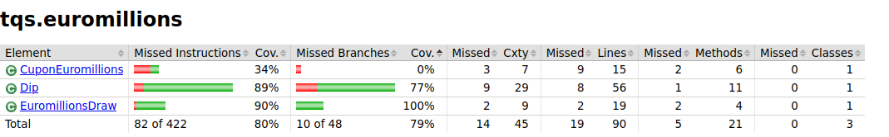
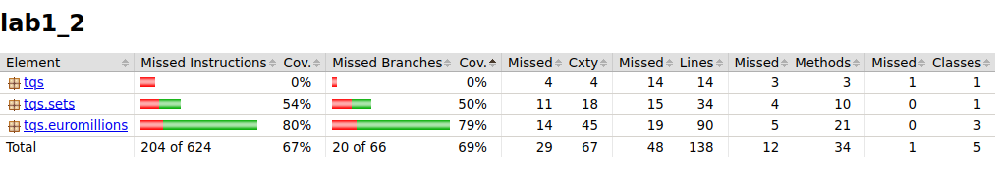

As classes/métodos que oferecem menor cobertura de uma forma geral são os métodos da pasta sets.

    

No entanto, dentro da pasta euromillions, o que oferece menor cobertura é o CuponEuromillions.

    

Quanto aos missed branches é um pouco difícil oferecer cobertura a todos.

    

Quanto à cobertura da classe BoundedSetOfNaturals a mesma falha em 50% dos branches e em 46% de instruções.

    

