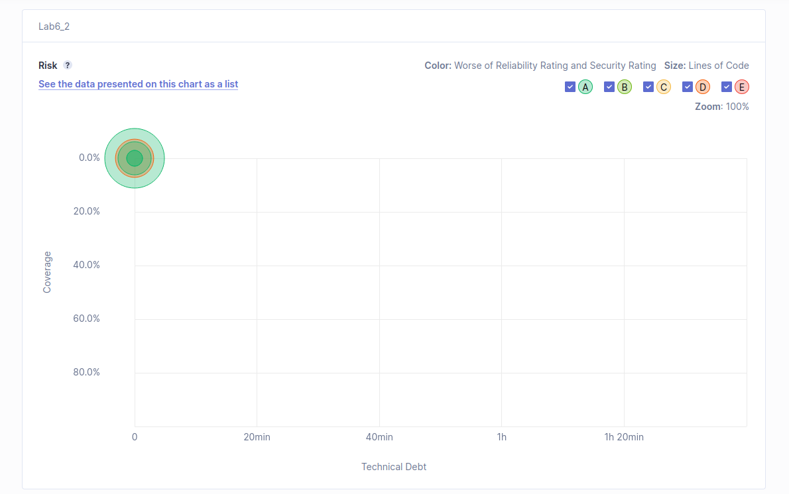

**Take note of the _technical debt found_. Explain what this value means. Document the analysis findings with a screenshot (of the sonar dashboard for this project).**

A dívida técnica é uma dívida ligada ao custo futuro do retrabalho do código, uma vez que foi priorizada a velocidade e o lançamento na produção do código em vez de se ter um código completo e finalizado.

    

**Run the static analysis and discuss the coverage values on the SonarQube dashboard (how many lines are “not covered”? And how many conditions? Are the values good?...)**

Tem 59.2% de cobertura, tendo 17 linhas por cobrir e 56 condições. O s valores não são tão bons quanto os esperados mesmo com quase 60% de cobertura.